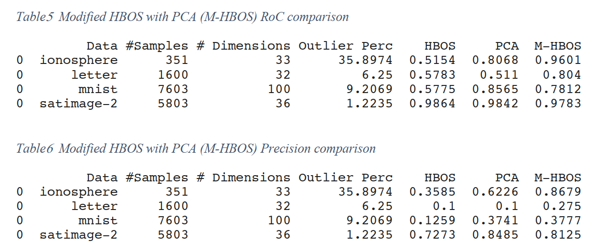
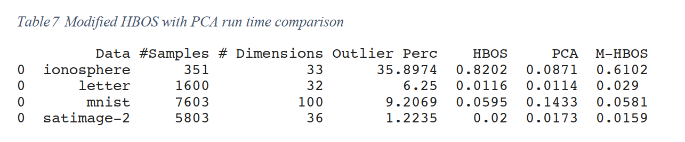

# HBOS Anomaly Detection
In this project I focus on anomaly detection algorithms and specifically on the paper
[“Histogram-based Outlier Score (HBOS)”] (https://www.researchgate.net/publication/231614824_Histogram-based_Outlier_Score_HBOS_A_fast_Unsupervised_Anomaly_Detection_Algorithm)https://www.researchgate.net/publication/231614824_Histogram-based_Outlier_Score_HBOS_A_fast_Unsupervised_Anomaly_Detection_Algorithm) for fast unsupervised anomaly detection by
Markus Goldstein and Andreas Dengel.

The article presents an innovation of the HBOS method in which it offers two options of a static
and dynamic histogram creation for determining the number of bins, for each dimension d, an
individual histogram has been computed where the height of each single bin represents a
density estimation. The histograms are then normalized such that the maximum height is 1.0.
This ensures an equal weight of each feature to the outlier score. Finally, the HBOS of every
instance p is calculated using the corresponding height of the bins where the instance is
located:
$𝐻𝐵𝑂𝑆(𝑝) = \sum_{i=0}_{n} log(\frac{1}{hist_i(p)})}$

One main advantage of HBOS is its linear computation time – introducing a big improvement
compared to most other approaches. On the other hand, one main disadvantage in HBOS is
that it can be sensitive to the bin width of the histogram. If the bins are too narrow, the normal
data points falling in these bins will be identified as outliers. If the bins are too wide, outliers will
fall into the bins of the normal data and be overlooked, in addition HBOS assumes that the
features are independent which is usually not the case in the real-world scenario.

# M-HBOS
Following the above papers I have written a modified HBOS algorithm using initial PCA to
reduce the dimensions/features as seen by the HBOS algorithm and thus making it easier for
the HBOS to identify the anomalies. We have run this on 4 different datasets comparing the
results of our modified HBOS (called mHBOS) vs the 2 used techniques as a stand-alone
namely PCA and HBOS. Important to mention that these two techniques are both relatively
fast in run time and thus maintain the HBOS original main advantage of fast run time
compared to more complex anomaly algorithms.

In order to do the comparison versus all other outlier detection algorithm we have used pyod
(Pyhton Outlier Detection) library in python, and added a new class called MHBOS to the
already existing classes inside pyod models, performing comparison both on performance as
well as run time on a long list of datasets.

  

We can see that in initial trial above adding softmax our M-HBOS got mixed results overcoming
the results of the original HBOS in the glass, ionosphere, mnist and vertebral datasets, but was
underperforming versus HBOS in all other datasets.
I have now modified our HBOS to perform PCA first keeping the number of principal
components such that the amount of variance that needs to be explained is greater than 80%,
this parameter can of course be tuned. We have run the comparison again with the PCA
modification and without the SoftMax added before. The results I got are:

  

